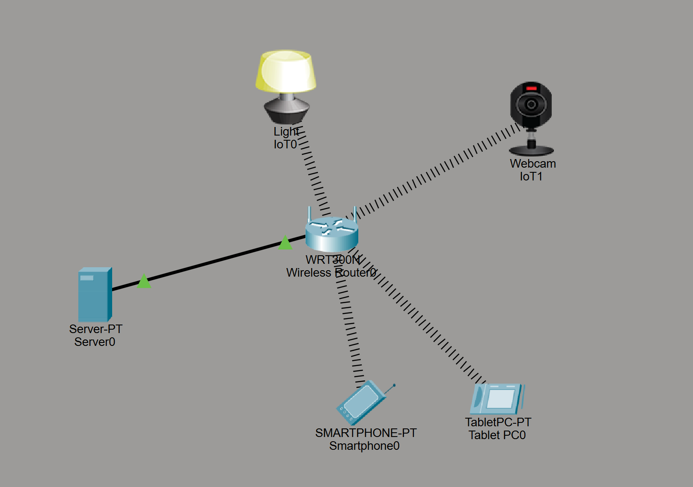
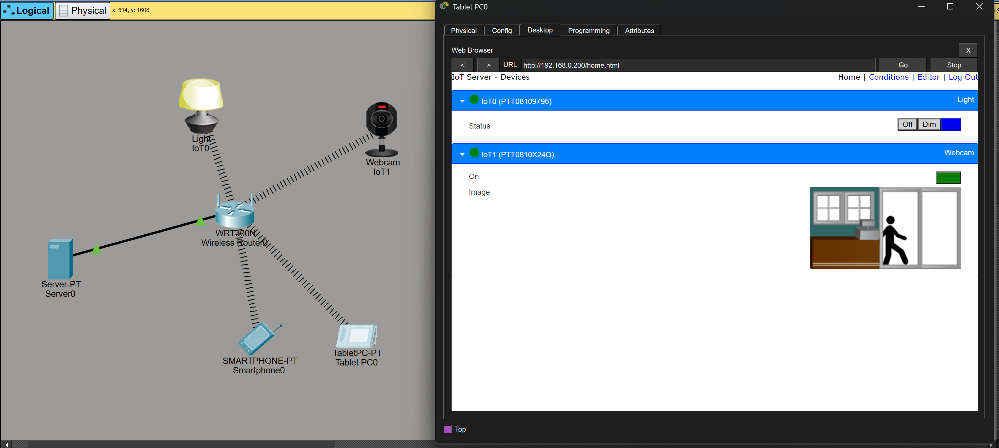
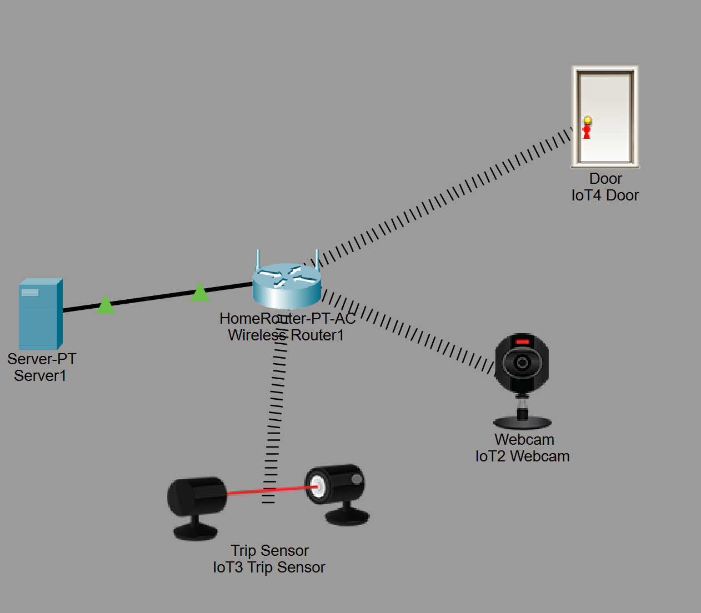
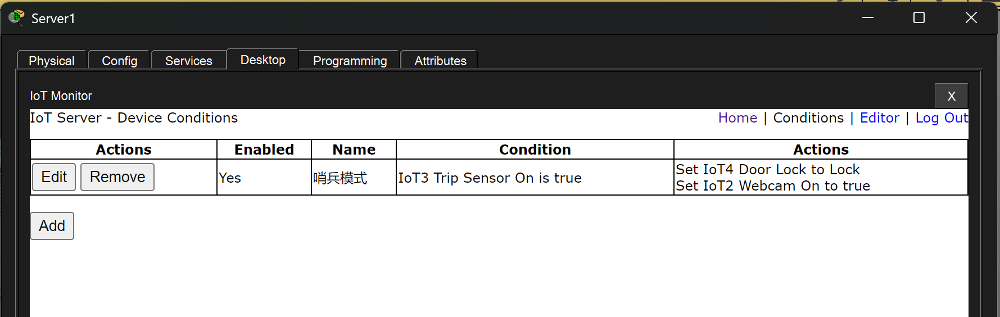
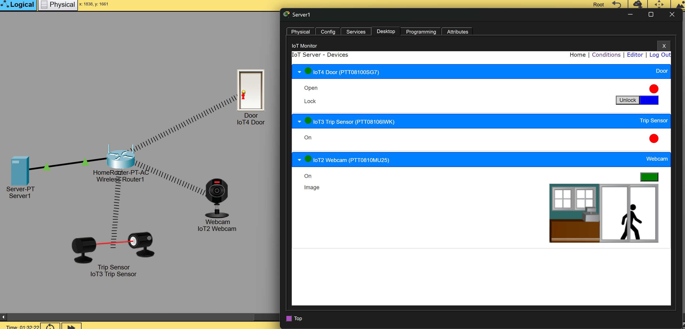
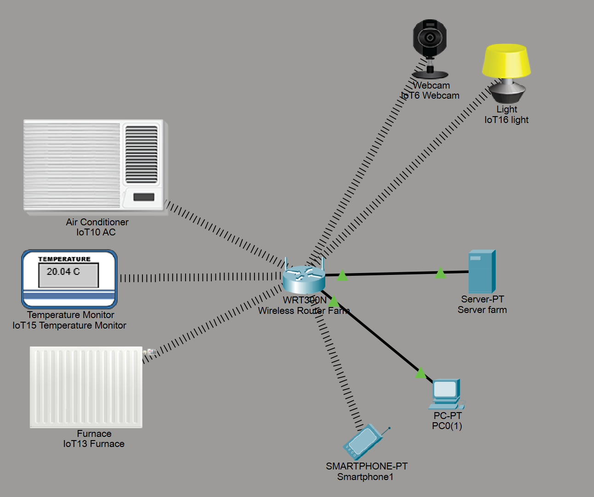
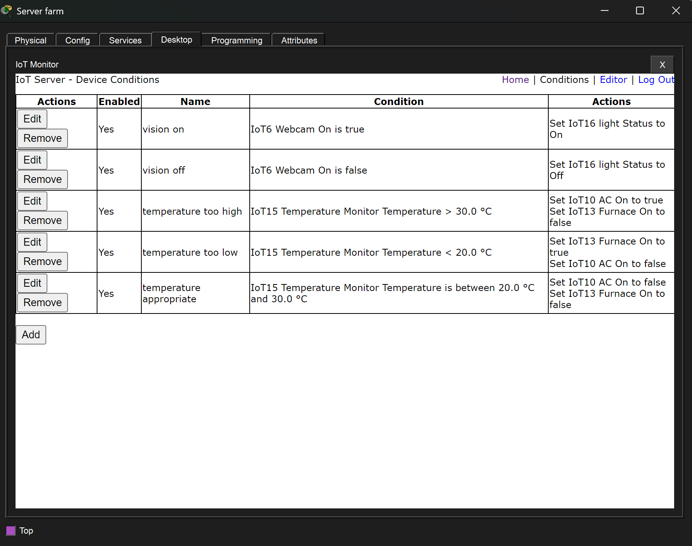
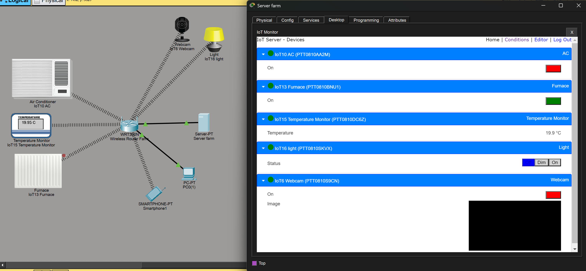
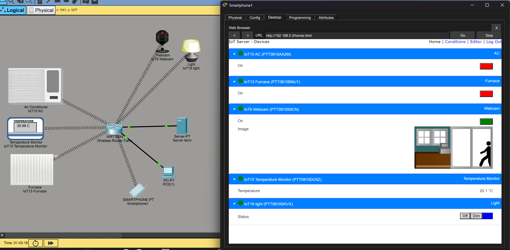

# 《物联网应用软件开发》实验一报告

智能软件与工程学院 - 231880098- 朱业航

2026.3.23

## 一、 实验目的

智能家居技术通过物联网 (IoT) 设备将日常家电连接到网络，使得用户能够远程控制和管理联网设备。Cisco Packet Tracer 是一个网络虚拟工具，能够模拟家庭网络的智能设备和网络通信等情况。本实验通过 Cisco Packet Tracer 模拟一系列智能家居环境，让学生了解物联网的日常应用，激发学习兴趣；同时，掌握物联网基础网络拓扑搭建与条件联动配置方法。

## 二、 实验内容及目标

1. 在 Cisco Packet Tracer 中配置一个基本的智能家居网络。
2. 实现对智能家电设备（如摄像头、智能门窗等）的远程控制。
3. 学习如何在局域网内配置无线及有线网络，并通过笔记本或智能移动终端控制各个智能设备。
4. 包含以下三个具体实践项目：
   - **实验一：创建智能家居网络（必做）**
   - **实验二：模拟防盗系统（必做）**
   - **实验三：模拟养殖场（选做）**

## 三、 实验环境与核心网元

- **软件工具**：Cisco Packet Tracer
- **网络设备**：无线路由器 (如 WRT300N)、物联网服务器 (Server)、终端通信与控制设备 (Smartphone、Tablet PC、PC 等)。
- **IoT 智能设备**：智能摄像头 (Webcam)、智能台灯 (Light)、智能门 (Door)、触发传感器 (Trip Sensor)、空调 (AC)、加热器 (Furnace)、温度监控器 (Temperature Monitor) 等。

---

## 四、 实验步骤与效果展示

### 实验一：创建智能家居网络

#### 1. 场景配置

在工作区中添加无线路由器以及需要控制的智能终端设备。配置移动设备与物联网终端处在同一个网络中，并且设置远程控制能力。

#### 2. 网络拓扑规划

向环境中拖入总控 Server 与中央无线路由器搭建基础架构；添加终端受控设备（智能台灯与摄像头控制端）并接入无线路由器，通过 Server 开启 IoT 注册监听服务。

#### 3. 智能设备控制测试

在各终端内配置好远端 IoT Server 地址后，使用平板/手机 Web 浏览器进入分配的 IP 管理页面；登录面板可实时捕获摄像头图像，或对智能照明进行开关、调光等测试操作。

### 实验二：模拟防盗系统

#### 1. 场景逻辑与要求

围绕家庭防盗监控需求设计：当有人非法侵入并触发室内报警装置时（Trip Sensor），系统联合作出锁定大门的动作以困住窃贼，与此同时自动开启内部摄像头进行取证。

#### 2. 设备部署与拓扑连线

按要求使用 Server 与路由器，并在该房间域内部署智能门窗 (Door)、绊线/触发传感器 (Trip Sensor) 以及记录摄像头 (Webcam)。设备组网互通并统一向 Server 进行注册托管。

#### 3. 编写 IoT 条件规则

在 Server 端打开“IoT Monitor -> Conditions”选项卡，添加一条智能联动规则**“哨兵模式”**：

- **触发条件 (Condition)**：当传感器被触发（`IoT3 Trip Sensor On is true`）。
- **执行动作 (Action)**：锁定智能门（`Set IoT4 Door Lock to Lock`），并同步开启室内摄像头记录（`Set IoT2 Webcam On to true`）。

#### 4. 效果校验

系统测试下，当手动模拟传感器探测到入侵时，监测平台状态实时产生变化。从设备后台观察到门已被反锁（Lock状态），且摄像头变为开启状态录入影像，防御规则被正确执行。

### 实验三：模拟智能恒温养殖场 (选做应用)

#### 1. 模拟要求与场景

针对养殖业环境设定温控自动化及安保可视方案：

1. **恒温控制**：养殖场温度须限制在 20°C ~ 30°C 之间。超过 30°C，自动开启制冷空调；低于 20°C，自动开启加热炉。位于正常温度区间时关闭调温机组，同时禁止冷暖齐开。
2. **可视监测**：配置供用户远程监控的内置摄像头；并在用户激活摄像头请求视频流时，强制联动打开区域照明灯光以保证拍摄清晰。

#### 2. 拓扑搭建与组件

在场景中心建立基于无线路由、PC 监控机、以及手机移动端的业务网；添加环境调控三件套（空调 AC、炉子 Furnace、恒温器 Temperature Monitor）及图像监控两件套（网络摄像头、室内灯光）等。

#### 3. 自动化条件规则定制

在智能条件配置中，通过逻辑条件完成业务对接：

- **灯光随动**：`vision on` (摄像头开启则灯开)、`vision off` (监控结束即刻熄灯)。
- **过热降温**：`temperature too high` (温度 > 30.0°C 则 `AC=true`, `Furnace=false`)。
- **过冷升温**：`temperature too low` (温度 < 20.0°C 则 `Furnace=true`, `AC=false`)。
- **正常待机**：`temperature appropriate` (介于范围之间时，冷暖两设备均休眠 false)。

#### 4. 环境模拟与状态观测

当环境因模拟发生温度波动（本例中传感器读数为 19.95℃，达到过冷判定线），依据条件，系统在设备面板中自动驱动加热炉 (Furnace = On) 并且空调处于离线状态。

与此同时，依据实验“使用手机查看摄像头”的要求。我们使用拓扑中的 Smartphone（智能手机）上的 Web Browser 登录控制端并进入摄像头视觉服务：当开启摄像头状态时（设为 On），系统能够顺利同步点亮室内的台灯设施，实现在手机端的联动控制。所有逻辑均符合验收预期。

---

## 五、 实验总结与体会

通过本次关于“智能家居与物联网控制”的模拟实践：

1. 掌握了运用 Cisco Packet Tracer 搭建基于 IoT Gateway / Server 的星型局域网络。通过图形化与仪表盘界面理解了物联网终端通过 IP 与协议注册到控制端的通信机制。
2. 了解并实践了物联网环境中的“动作事件绑定”与“条件编排”，成功运用阈值传感器信息（诸如红外绊线、温湿度计）反哺给执行机构（锁、灯、空调等）。
3. 设计实现了三个层次的实验任务，尤其在防盗系统以及养殖场恒温调控这两个业务场景中，亲身体验了物联网边缘计算的逻辑策略，极大地培养了将系统开发思维应用于现实设施控制的项目实践能力。
