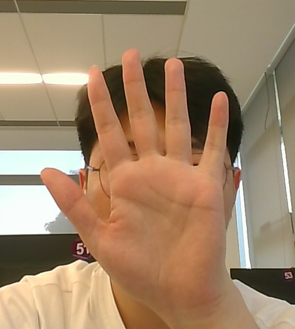
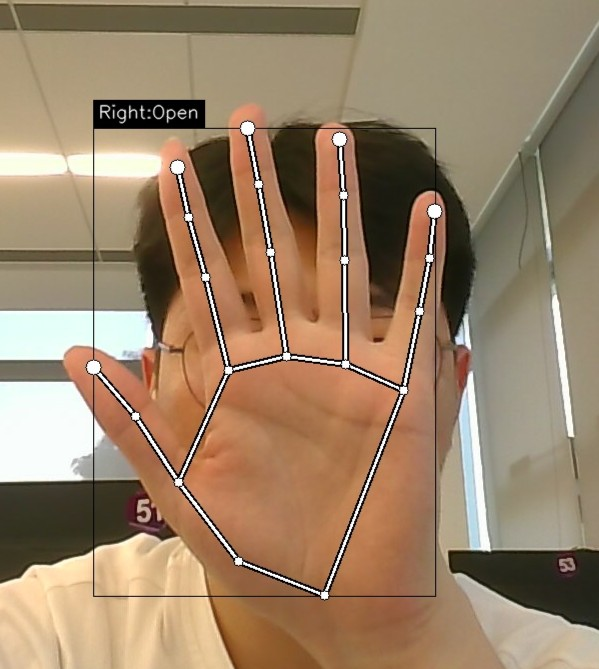
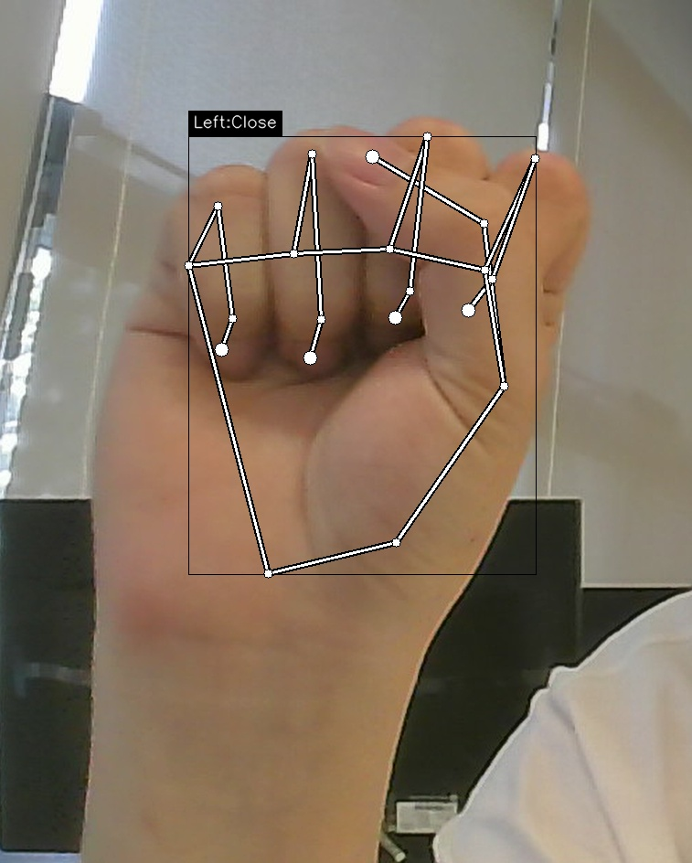
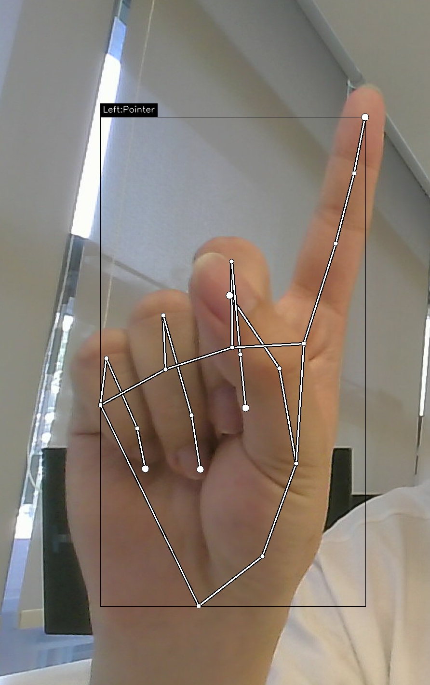
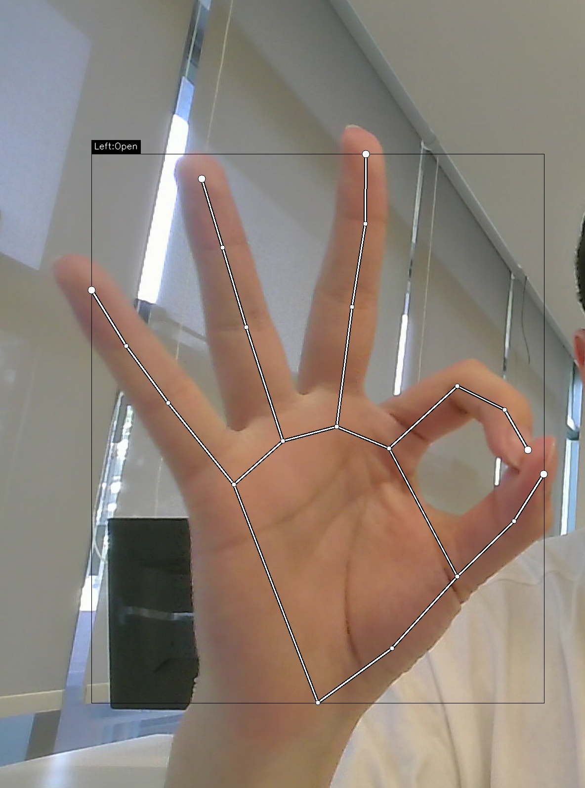
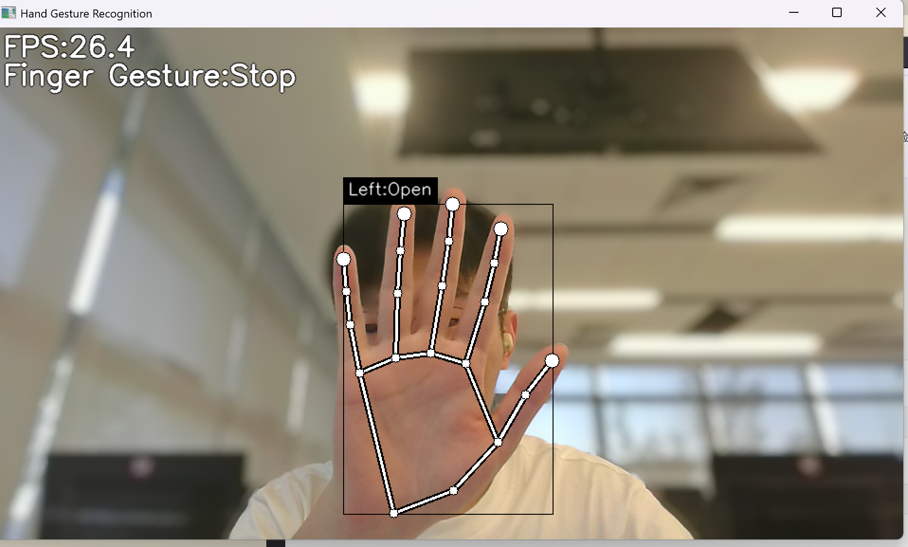
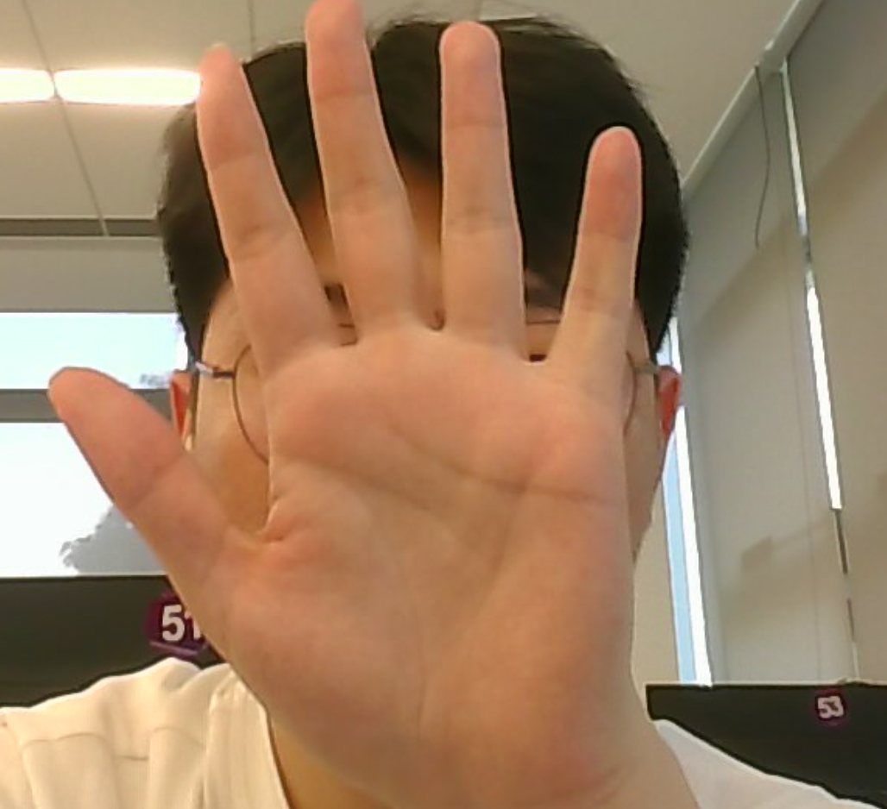
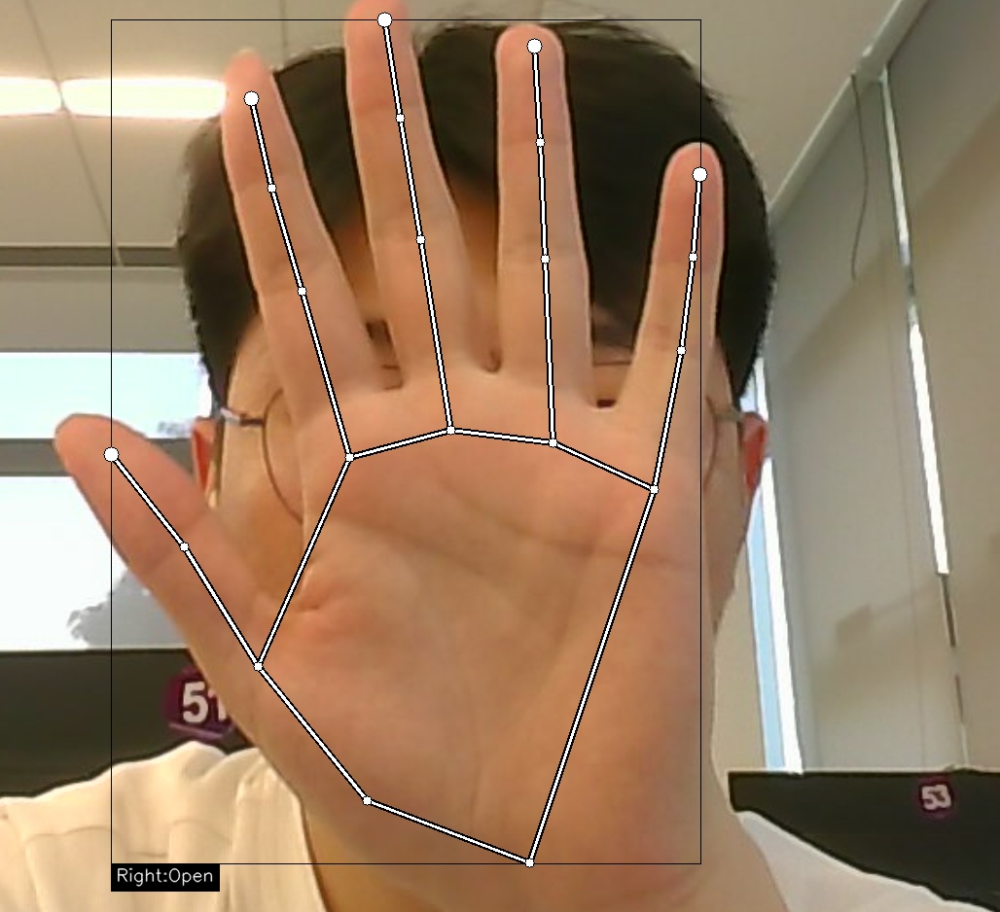

# 物联网应用软件开发课程实验三——手势识别实验报告

**姓名：** 朱业航  
**学号：** 231880098  
**日期：** 2026 年 5 月 11 日

---

## 一、实验环境

| 项目 | 内容 |
|---|---|
| 操作系统 | Windows 11 |
| Python 版本 | 3.11.x |
| OpenCV | 4.11.0 |
| MediaPipe | 0.10.14 |
| TensorFlow | 2.15.1 |
| NumPy | 1.26.4 |

**环境创建与依赖安装：**

```bash
# 创建环境
conda create -n hand python=3.11 -y

# 激活环境
conda activate hand

# 安装依赖
pip install mediapipe==0.10.14 tensorflow==2.15.1 opencv-contrib-python==4.11.0.86 numpy==1.26.4
```

> 注：安装过程中曾遇到 `mediapipe` 新版缺少 `solutions` 接口、`tensorflow` 与 `jax` 的 `ml_dtypes` 版本冲突等问题，最终通过降级 mediapipe 到 0.10.14 并卸载 jax/jaxlib 解决。

---

## 二、基础实验：运行图片手势识别

### 2.1 运行命令

```bash
python app.py --image hand.jpg --output result.jpg --no_display
```

### 2.2 终端输出

```
(hand) C:\Users\Zhu_yehang\iCloudDrive\课程资料大三下\物联网应用软件开发\实验\实验三\hand-gesture-recognition>python app.py --image hand.jpg --output result.jpg --no_display
...
Detected hand signs: Open
Saved result: result.jpg
```

### 2.3 结果截图

本部分展示不同手势分类的输入与输出结果，包含识别成功的案例（Open、Close、Pointer）与因模型局限性识别失败的案例（OK由于手部遮挡/角度原因被误分类为Open）。

<table align="center">
  <tr>
    <td align="center"><b>1. Open 手势（成功）</b><br> </td>
    <td align="center"><b>2. Close 手势（成功）</b><br> </td>
  </tr>
  <tr>
    <td align="center"><b>3. Pointer 手势（成功）</b><br> </td>
    <td align="center"><b>4. OK 手势（失败，误识别为 Open）</b><br> </td>
  </tr>
</table>

### 2.4 处理流程简述

图片经过以下步骤得到手势标签：

1. **OpenCV 读取图片**：将 `hand_open.jpg` 读入为 RGB 图像。
2. **MediaPipe Hands 检测**：调用 `mp.solutions.hands` 检测手部，定位 21 个关键点（手腕、各手指关节）。
3. **坐标相对化与归一化**：以手腕（第 0 点）为基准，将所有关键点坐标转为相对坐标，再按最大绝对值缩放，得到 42 维特征向量。
4. **TFLite 模型推理**：将特征向量输入 `keypoint_classifier.tflite`，输出手势类别索引。
5. **标签映射**：根据 `keypoint_classifier_label.csv` 将索引映射为 `Open` / `Close` / `Pointer` / `OK`。
6. **OpenCV 绘图**：在原图上绘制关键点、骨架连线、边界框和识别标签，保存为 `result_open.jpg`。

---

### 2.5 实时摄像头识别

除了图片识别外，本实验也通过摄像头进行了实时手势识别验证。

**运行命令：**

```bash
python app.py
```

**运行效果截图：**

<div align="center">
  
</div>

摄像头模式下，程序逐帧采集画面，调用 MediaPipe 进行手部检测和关键点提取，并通过 TFLite 模型实时输出手势分类结果，同时在画面中叠加绘制关键点、骨架连线、边界框和识别标签。该模式验证了本项目可用于实时视频流场景，为物联网边缘设备上的实时手势控制提供了基础。

---

## 三、拓展实验

### 3.1 小实验 1：图片输入功能分析

#### 任务目标

理解如何将原摄像头程序改造成图片识别程序，分析两种模式的区别。

#### 修改内容 / 操作过程

在 `app.py` 中新增了三个命令行参数以实现图片输入功能：

```python
parser.add_argument("--image", help='input image path', type=str)
parser.add_argument("--output", help='output image path', type=str)
parser.add_argument("--no_display", action='store_true')
```

新增了 `run_image_mode()`、`imread_unicode()`、`imwrite_unicode()` 等函数。

#### 运行结果

已在本报告第二章的基础实验中展示。

**输入与输出对比：**

<table align="center">
  <tr>
    <td align="center"><b>输入 `hand_close.jpg`</b><br></td>
    <td align="center"><b>输出 `result_close.jpg`</b><br></td>
  </tr>
</table>

#### 分析与思考

**1. 摄像头模式和图片模式的数据来源有什么区别？**

摄像头模式通过 `cv.VideoCapture` 逐帧读取实时视频流，程序在一个循环中不断采集、处理、显示画面；图片模式则通过 `imread_unicode()` 一次性读取单张图片，处理完毕后直接保存或显示结果，没有循环。

**2. 为什么图片模式中 `static_image_mode` 应该设为 `True`？**

`static_image_mode=True` 指示 MediaPipe 本次处理的是独立图片而非视频流，此时 MediaPipe 会执行更严格的逐帧检测而不会依赖帧间预测，在单张图片上检测更稳定。

**3. 为什么中文路径下使用 `cv.imdecode()` 和 `cv.imencode()` 比直接 `cv.imread()` 更稳妥？**

`cv.imread()` 和 `cv.imwrite()` 底层调用的 C/C++ 标准库函数不支持 Unicode 路径，当文件路径包含中文字符时会读取失败。而 `cv.imdecode()` 配合 `np.fromfile()`（支持 Unicode），以及 `cv.imencode()` 配合 `.tofile()`，能正确读写任意 Unicode 路径的文件。

---

### 3.2 小实验 2：标注位置修复

#### 任务目标

解决识别标签被图片边界裁切的问题。当手掌靠近图片顶部时，标签不可见，需要修改 `draw_info_text()` 函数，使其智能选择标签绘制位置。

#### 修改内容 / 操作过程

**位置：** `app.py` 中的 `draw_info_text()` 函数。

**原始代码的问题分析：**

原始代码中，当手掌靠近图片顶部时，标签会画到图片外不可见。虽然代码已有"上方空间不够则画在下方"的逻辑，但存在两个缺陷：

1. **Bug：** 画在下方时使用了 `brect[1]`（边界框的顶部 y 坐标），导致标签与手部重叠；
2. **隐患：** 未考虑图片底部边界，标签仍可能被底部裁切。

**修改后的逻辑**（四个优先级）：

```python
if 框上方有足够空间:
    画在框上方
elif 框下方有足够空间:
    画在框下方（用 brect[3] 即框的底边）
elif 框更靠近底边:
    画在上方并压边（用 max(0, ...) 防止越界）
else:
    画在下方并压边（用 min(image_height, ...) 防止越界）
```

关键改动点：
- 获取 `image_height` 以判断底部边界
- 下方绘制时使用 `brect[3]`（框的底边 y 坐标）而非 `brect[1]`
- 增加底部越界保护和图片压边处理

#### 运行结果

**对比效果（左：输入 `hand_top.jpg`，右：输出 `hand_top_result.jpg`）：**

<div align="center">
  
  
</div>

可以看到虽然手靠近图片顶部、上方空间不足，但标签自动画在边界框下方，清晰显示 `Right:Open`，无裁切或与手部重叠的问题。

#### 分析与思考

本次修复说明，在视觉标注任务中不能假设标注对象一定位于图像中央。实际应用中（如物联网边缘设备），摄像头采集角度和位置多变，手部可能在画面中任意位置。编写标注代码时应始终考虑四种边界情况（上、下、左、右），并使用 `max()` 和 `min()` 进行边界约束，确保文字始终可见。

---

### 3.3 小实验 6：IoT 控制规则设计

#### 任务目标

将手势识别结果映射为物联网控制动作，模拟边缘设备根据手势控制智能家居的场景。

#### 修改内容 / 操作过程

在 `app.py` 中添加 IoT 动作映射表和日志记录功能。

**1. 定义手势控制映射表：**

| 手势 | 动作 ID | 动作描述 |
|---|---|---|
| `Open` | `light_on` | 打开灯光 |
| `Close` | `light_off` | 关闭灯光 |
| `Pointer` | `next_page` | 下一页 |
| `OK` | `confirm` | 确认操作 |

**2. 修改 `run_image_mode()` 函数：**

在识别到手势后，根据映射表输出 IoT 控制指令并记录日志：

```python
if hand_sign_text in GESTURE_ACTIONS:
    action_id, action_desc = GESTURE_ACTIONS[hand_sign_text]
    print(f'IoT Action: {action_id} ({action_desc})')
    log_iot_action(...)
```

**3. 日志记录（`action_log.csv`）：**

实际运行时生成的日志文件内容如下：

| 时间 | 来源图片 | 手势 | 动作 ID | 动作描述 | MQTT 消息 |
|---|---|---|---|---|---|
| 2026-05-11 16:04 | hand1.jpg | Open | light_on | 打开灯光 | `{"device_id":"edge_camera_01","gesture":"Open","action":"light_on"}` |
| 2026-05-11 16:20 | hand_open.jpg | Open | light_on | 打开灯光 | `{"device_id":"edge_camera_01","gesture":"Open","action":"light_on"}` |
| 2026-05-11 16:24 | hand_close.jpg | Close | light_off | 关闭灯光 | `{"device_id":"edge_camera_01","gesture":"Close","action":"light_off"}` |
| 2026-05-11 16:26 | hand_point.jpg | Pointer | next_page | 下一页 | `{"device_id":"edge_camera_01","gesture":"Pointer","action":"next_page"}` |
| 2026-05-11 16:27 | hand_ok.jpg | Open* | light_on* | 打开灯光* | `{"device_id":"edge_camera_01","gesture":"Open*","action":"light_on*"}` |

> \* 标记的行是 OK 手势被误识别为 Open 的情况（见下方分析）。

#### 运行结果实例

```bash
python app.py --image hand1.jpg --output result1.jpg --no_display
```

终端输出：

```
(hand) C:\Users\Zhu_yehang\iCloudDrive\课程资料大三下\物联网应用软件开发\实验\实验三\hand-gesture-recognition>python app.py --image hand_open.jpg --output result_open.jpg --no_display
...
...
IoT Action: light_on (打开灯光)
Detected hand signs: Open
Saved result: result_open.jpg
```
```
(hand) C:\Users\Zhu_yehang\iCloudDrive\课程资料大三下\物联网应用软件开发\实验\实验三\hand-gesture-recognition>python app.py --image hand_close.jpg --output result_close.jpg --no_display
...
...
IoT Action: light_off (关闭灯光)
Detected hand signs: Close
Saved result: result_close.jpg
```
```
(hand) C:\Users\Zhu_yehang\iCloudDrive\课程资料大三下\物联网应用软件开发\实验\实验三\hand-gesture-recognition>python app.py --image hand_point.jpg --output result_point.jpg --no_display
...
...
IoT Action: next_page (下一页)
Detected hand signs: Pointer
Saved result: result_point.jpg
```


生成的 `action_log.csv` 日志文件包含完整的识别时间、手势和对应的 IoT 控制指令。

#### 分析与思考

通过将手势识别结果映射为控制动作，本实验展示了手势识别在物联网中的典型应用场景。实际部署时，IoT 动作可以通过以下方式执行：

- **MQTT 协议**：将 `mqtt_message` 发送到 MQTT Broker，由智能家居设备订阅并执行
- **本地直连**：边缘设备通过 GPIO 或串口直接控制硬件（如树莓派控制继电器）
- **HTTP API**：通过 REST API 调用云端或局域网内的智能设备接口

需要注意的问题：

- **模型局限性**：在本次测试中，OK 手势（拇指与食指捏合）被误识别为 Open。原因是本项目使用的预训练 TFLite 模型训练数据有限，OK 手势在部分角度下关键点特征与 Open 手势相似。这属于模型的正常边界情况，并非本实验代码的问题。如需真正支持 OK 手势，需重新采集 OK 手势的关键点数据并重新训练模型。
- **错误识别风险**：错误识别可能触发错误控制动作（如误识别为 Close 而关灯），实际部署时可通过置信度阈值过滤、多帧确认（连续 N 帧识别结果一致才执行）等方式降低风险。
- **日志价值**：日志记录有助于追溯和调试，为后续的模型优化提供数据支持。

---

### 3.4 小实验 3：检测阈值敏感性实验

#### 任务目标

理解 `min_detection_confidence` 参数对 MediaPipe 手部检测结果的影响，探索不同阈值下的检测效果差异。

#### 操作过程

使用同一张图片 `hand1.jpg`，分别以不同阈值运行识别：

```bash
python app.py --image hand1.jpg --output result_03.jpg --no_display --min_detection_confidence 0.3
python app.py --image hand1.jpg --output result_09.jpg --no_display --min_detection_confidence 0.9
python app.py --image hand1.jpg --output result_99.jpg --no_display --min_detection_confidence 0.99
```

#### 运行结果

| 阈值 | 是否检测到手 | 识别标签 | 观察 |
|---|---|---|---|
| 0.3 | ✅ 是 | Open | 检测迅速，标签正常显示 |
| 0.7（默认） | ✅ 是 | Open | 和 0.3 无肉眼可见差别 |
| 0.9 | ✅ 是 | Open | 仍成功检测 |
| 0.99 | ❌ 否 | — | 未检测到手，提示 `No hand detected.` |

#### 分析与思考

- **阈值过低的问题**：阈值过低（如 0.3）时，MediaPipe 可能将画面中类似手部的噪声也当作手检测出来，导致**误检**（False Positive）。在背景复杂的场景中尤为明显。
- **阈值过高的影响**：阈值过高（如 0.99）时，即使图片中确实有手，也可能因轻微模糊、遮挡或角度偏差导致检测置信度不足而被忽略，造成**漏检**（False Negative）。
- **物联网设备中的选择建议**：边缘设备一般光线和位置相对可控，推荐使用 **0.5 - 0.8 的默认阈值**。如果部署场景光线充足且摄像头固定，可适当提高（如 0.7）；如果场景中有较多干扰物，不宜过低（不低于 0.5），否则误检率会显著上升。最佳做法是在实际场景中抽样测试，确定合适的阈值。

---

## 四、思考题

### 4.1 为什么手势识别项目要先检测关键点，而不是直接把整张图片输入分类器？

如果直接把整张图片输入分类器，模型需要同时学习"手的位置"、"手的大小"、"背景"和"手势形状"等多个因素，对图片的尺寸、位置、背景变化非常敏感，泛化能力差。而先检测关键点，将 21 个手部位置信息提取出来，模型只需要关注"手指之间的相对几何关系"，数据量也从整张图片（数十万像素）降到了 42 个数值，推理速度更快、模型更小，更适合边缘设备部署。

### 4.2 关键点归一化对模型泛化有什么作用？

归一化消除了手的位置和大小对识别的影响。同一个手势在画面左侧和右侧、靠近和远离摄像头时，像素坐标完全不同，但经过"以手腕为基准做相对坐标 + 按最大绝对值缩放"的归一化后，特征向量趋于一致。这使得模型能够识别不同位置、不同大小的同一手势，大幅提高泛化能力。

### 4.3 没有摄像头时，如何调整实验设计保证课程仍然完整？

可以使用图片输入模式替代摄像头。本实验已在 `app.py` 中增加了 `--image`、`--output`、`--no_display` 参数，学生可以提前准备好手势图片（自拍或网上下载），使用 `python app.py --image hand.jpg --output result.jpg --no_display` 完成识别。图片模式同样覆盖了完整的处理流程（图像读取 → MediaPipe 检测 → 关键点提取 → 归一化 → TFLite 推理 → OpenCV 标注），不影响对核心原理的学习。

### 4.4 如果识别结果用于控制真实设备，错误识别可能带来什么风险？应该如何降低风险？

风险包括：误识别导致设备误动作（如误关灯造成安全隐患）、关键手势漏识别导致操作无响应、在多人场景下误响应他人手势等。

降低风险的方法：
- **多帧确认**：连续 N 帧识别结果一致才执行动作
- **置信度阈值**：设置较高的检测置信度下限
- **动作确认机制**：关键操作要求用户重复一次手势确认
- **日志记录**：记录所有识别结果和触发动作，便于事后追溯
- **人工急停**：保留物理开关或语音指令作为紧急停止手段

### 4.5 在物联网系统中，本地识别和云端识别各有什么优缺点？

| 对比项 | 本地识别（边缘端） | 云端识别 |
|---|---|---|
| **延迟** | 低（毫秒级，无需网络） | 高（受网络延迟影响） |
| **隐私性** | 高（数据不出设备） | 低（需上传数据到云端） |
| **带宽需求** | 低（只上传标签结果） | 高（需上传图片或视频流） |
| **模型能力** | 受限于设备算力，模型较小 | 可使用大型模型，准确率更高 |
| **离线可用** | ✅ 是 | ❌ 否 |
| **维护成本** | 需本地更新模型 | 云端统一更新更方便 |

本实验属于本地识别方案——摄像头采集画面，边缘设备本地完成全部推理，仅上传手势标签，兼具低延迟和隐私保护优势。

---

## 五、实验总结

本次实验完成了基于 MediaPipe 和 TensorFlow Lite 的手势识别系统的搭建与应用。通过实验，掌握了从图像采集、手部关键点提取、特征归一化到 TFLite 模型推理的完整处理流程，并成功在图片模式和摄像头模式下运行了手势识别。

在环境配置过程中，解决了 MediaPipe 新版本不兼容旧接口、TensorFlow 与 JAX 依赖冲突等问题，加深了对 Python 包管理机制的理解。

在拓展实验中，完成了三个实验：
1. **图片输入功能分析**：理解了摄像头模式和图片模式的区别，以及中文路径读写的正确方法；
2. **标注位置修复**：修复了 `draw_info_text()` 函数中标签在图片边界被裁切的问题，增强了标注的健壮性；
3. **IoT 控制规则设计**：将手势识别结果映射为物联网控制动作，并设计了 MQTT 消息格式和日志记录机制；
4. **阈值敏感性实验**：测试了不同检测置信度阈值对识别结果的影响，为实际部署中的参数选择提供了参考。

通过本实验，深入理解了关键点检测相比端到端图像分类在边缘设备上的优势，以及归一化处理对模型泛化能力的重要作用。为今后在物联网场景中设计和部署视觉 AI 应用打下了基础。
