# 实验二：人脸表情识别系统实验报告
南京大学智能软件与工程学院——
231880098——
朱业航

## 1. 实验目的
理解基于卷积神经网络（CNN）的表情识别原理，掌握并实践人脸检测、图片预处理、模型训练与界面集成的应用开发流程。

## 2. 实验环境搭建 (必做)
配置了基于 Anaconda 与 Python 3.6 的虚拟环境 `FER`，并安装了 TensorFlow 2.3.1、PyQt5、OpenCV 等必需依赖。

> 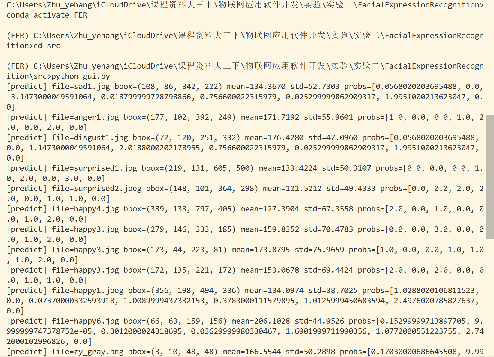

## 3. 实验过程及结果 (必做)

### 3.1 训练过程
通过运行 `train.py` 使用 FER2013 数据集对改写后的深度卷积神经网络模型进行训练。在此过程中代码将训练集图片按批次送入网络，并计算 `loss` 和 `accuracy` 指标。

> 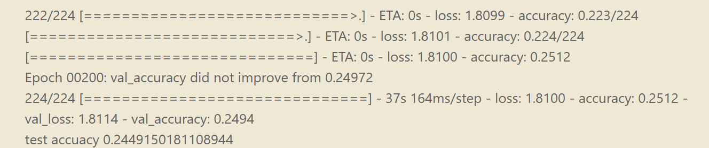

### 3.2 启动GUI界面
采用 PyQt5 编写并优化了主窗体应用程序界面，在终端运行 `python gui.py` 启动可视化操作窗口。

### 3.3 图片识别效果
点击界面中的“选择图片”按钮导入一张人物测试图片，系统首先利用级联分类器捕捉人脸区域，截取人脸后进行灰度化与缩放尺寸等预处理，送入训练好的 CNN 模型预测。通过后台线程异步执行保证了 UI 界面的流畅性，最终计算出面部八种表情的置信度直方图。

为验证模型能够准确识别不同表情模式，对图库中的十二张图片进行了完整预测：

<table>
  <tr>
    <td>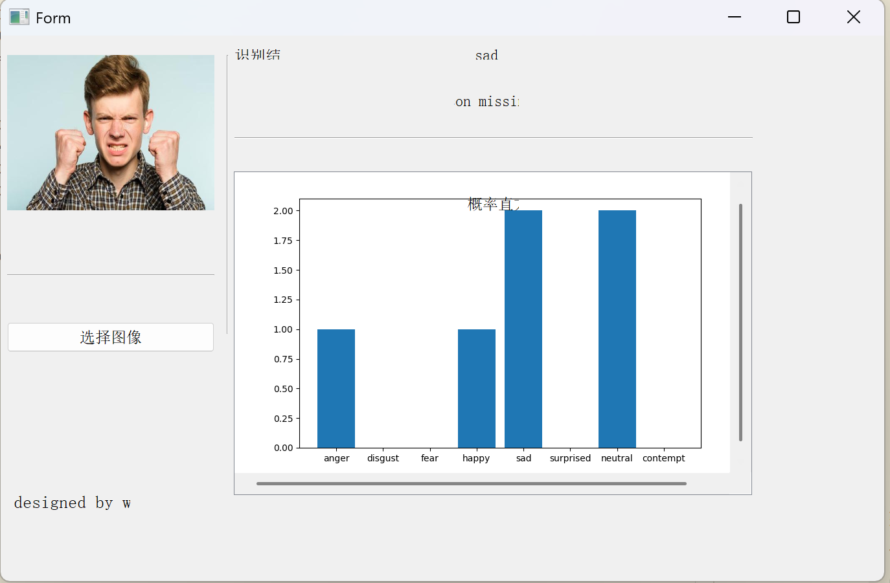 
测试图一
</td>
    <td>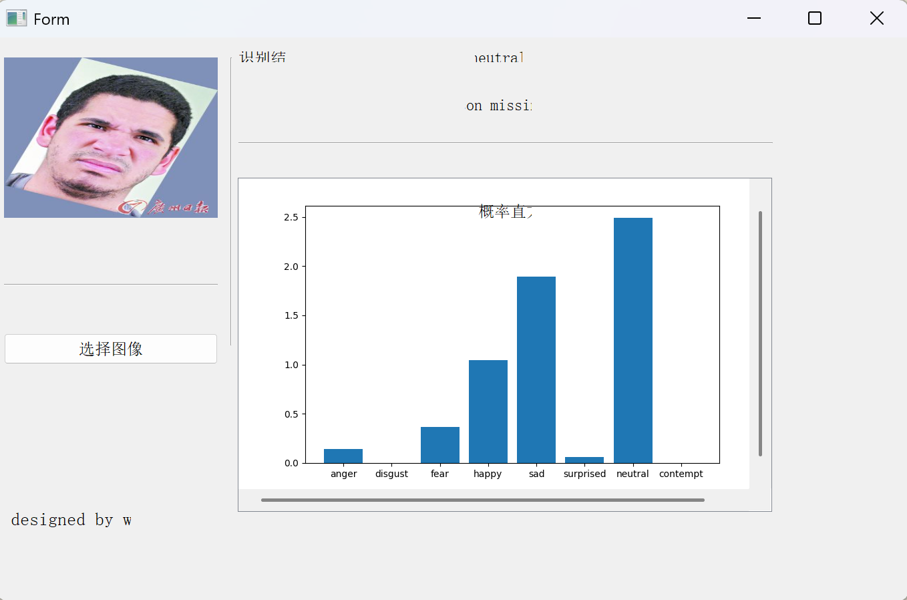 
测试图二
</td>
    <td>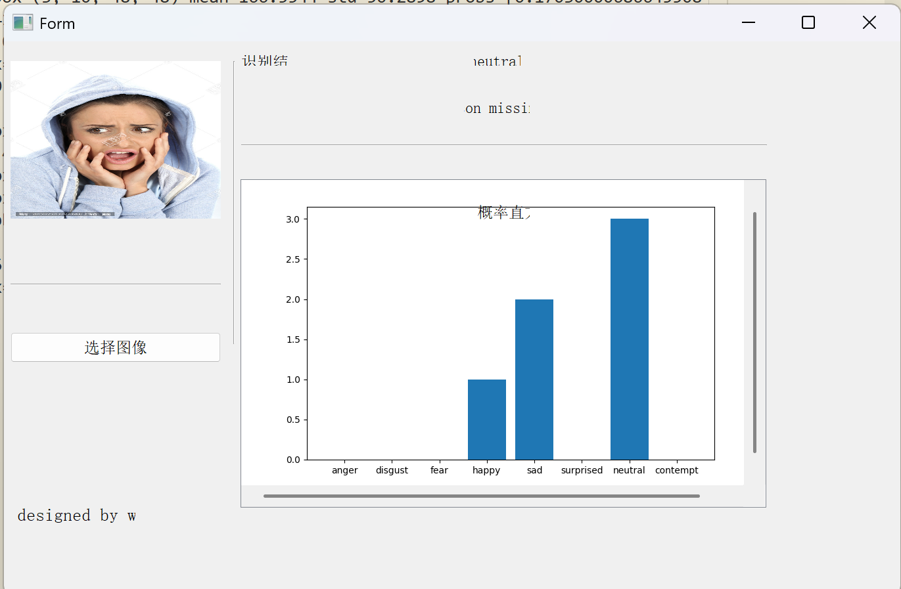 
测试图三
</td>
  </tr>
  <tr>
    <td>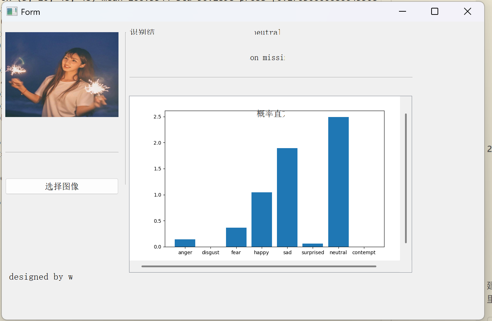 
测试图四
</td>
    <td>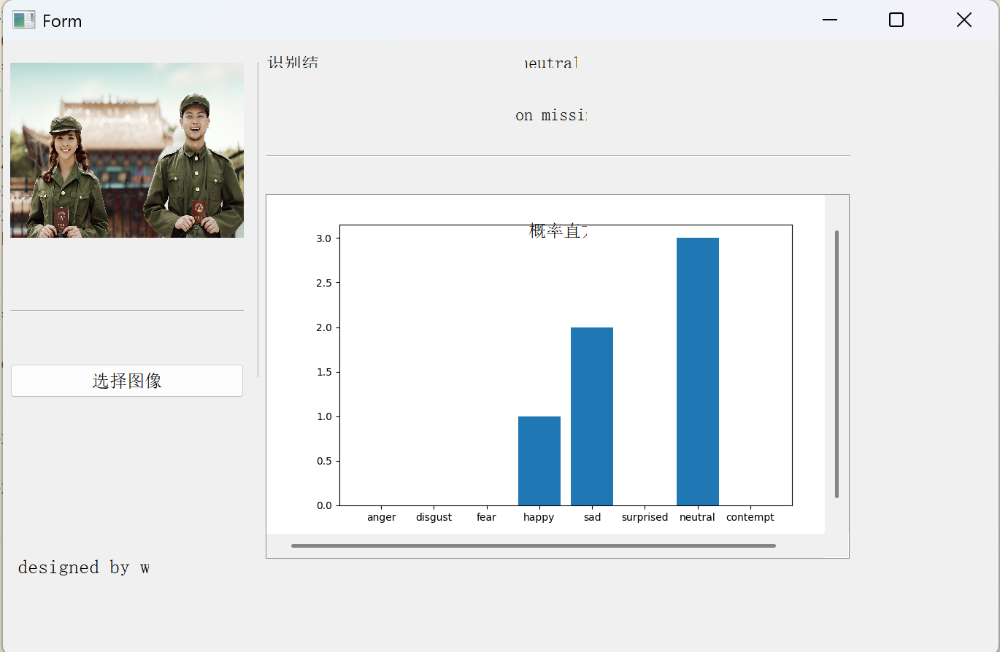 
测试图五
</td>
    <td>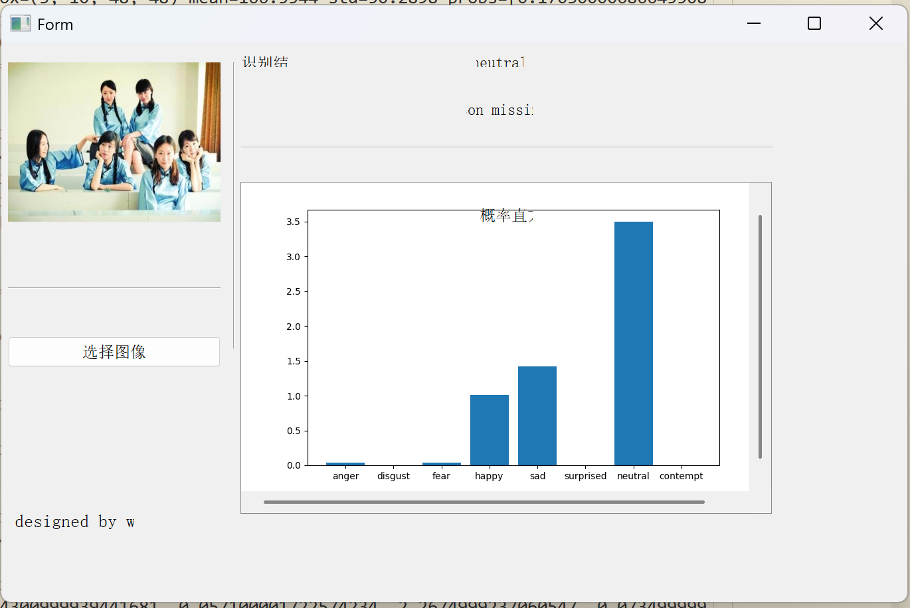 
测试图六
</td>
  </tr>
  <tr>
    <td>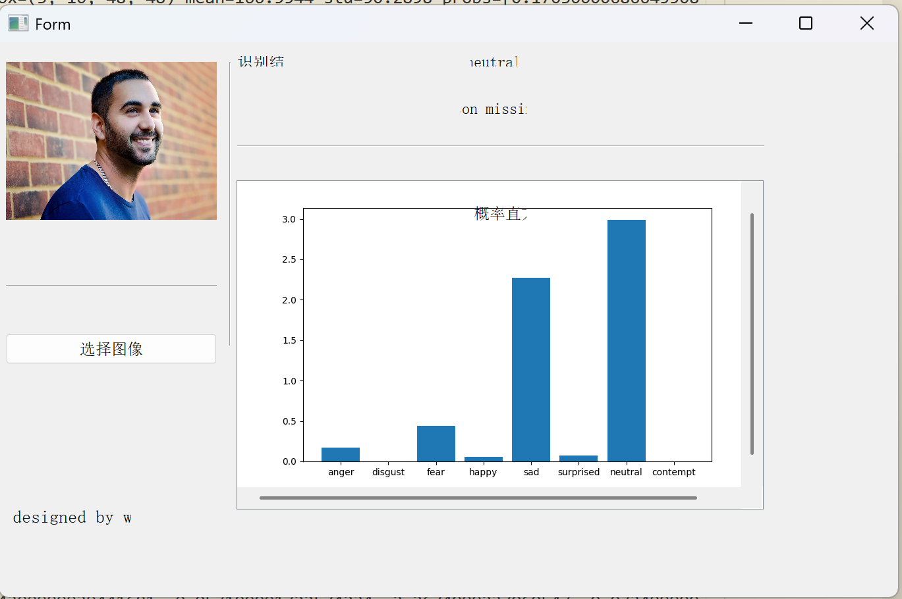 
测试图七
</td>
    <td>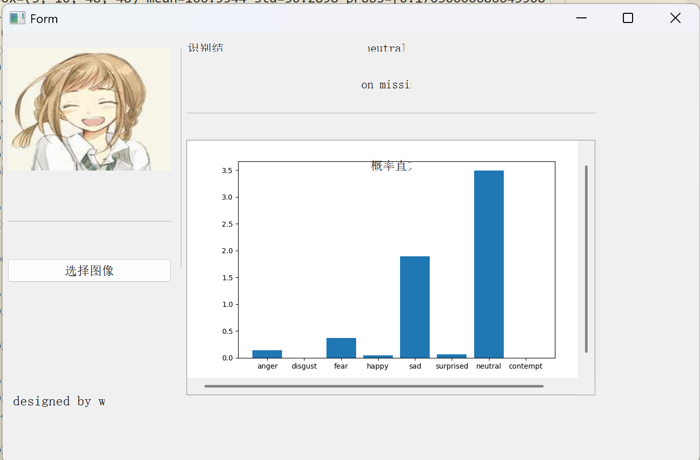 
测试图八
</td>
    <td>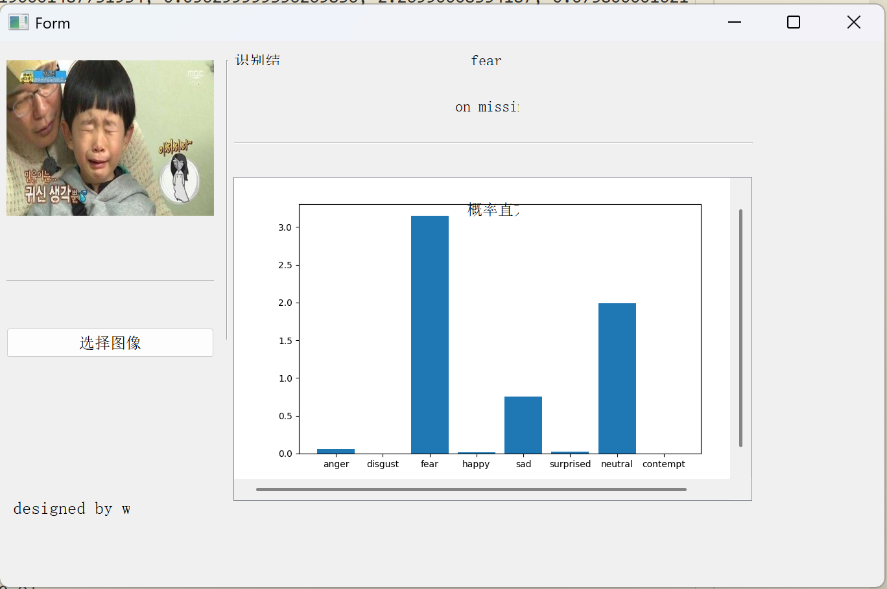 
测试图九
</td>
  </tr>
  <tr>
    <td>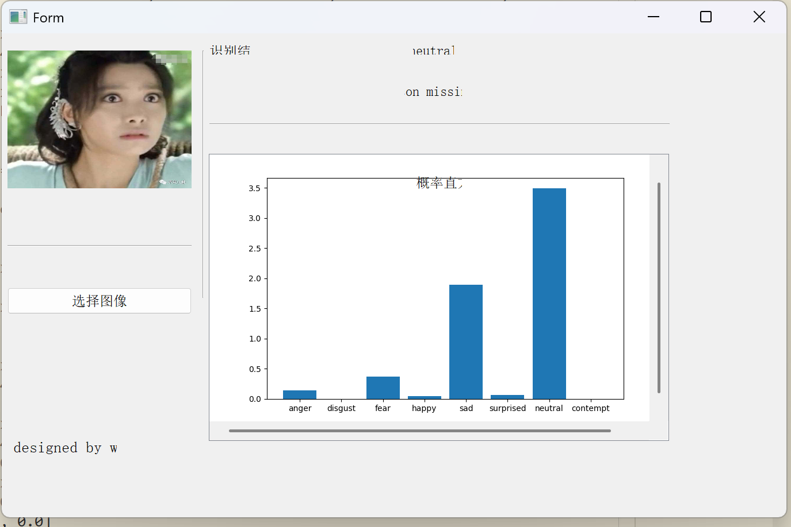 
测试图十
</td>
    <td>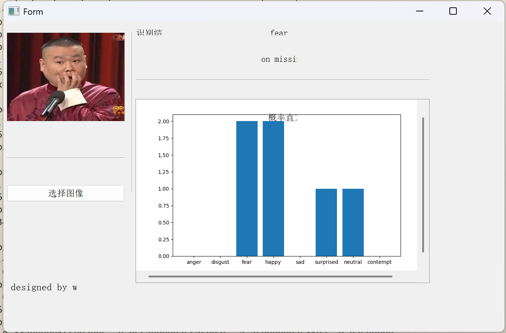 
测试图十一
</td>
    <td>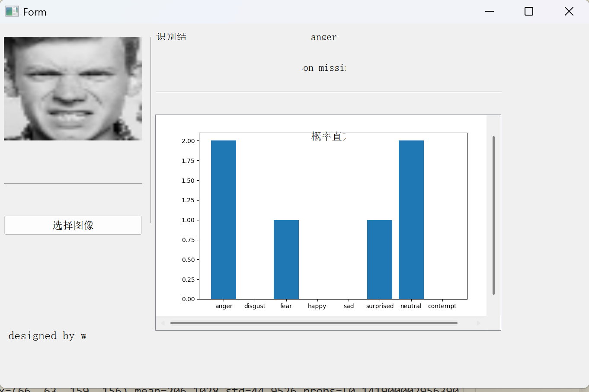 
测试图十二
</td>
  </tr>
</table>

> 
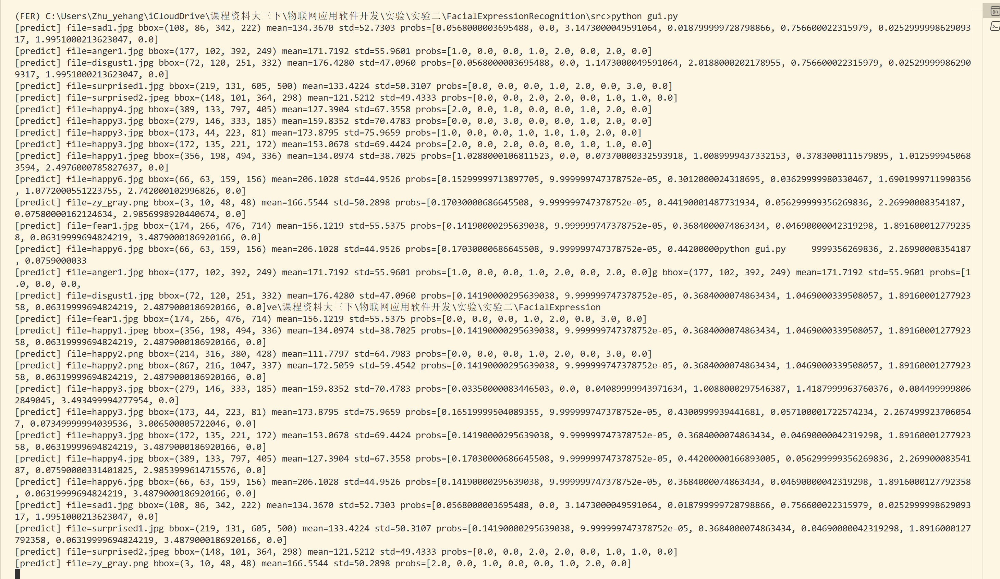 12张图片完整识别数据总览

**【识别效果与现象分析】**
尽管模型经训练后，已经能够针对不同人脸给出具有差异化的置信度直方分布，**但在实际验证中，整体识别准确率依然偏低，在测试集上的最终精度徘徊在 24%~30% 左右。** 
表现出的直观现象是：遇到带有夸张特征的“大笑(happy)”、“极度愤怒(anger)”等表情时判断相对较准；但对于微表情或者相近情绪（如“中性(neutral)”、“悲伤(sad)”、“恐惧(fear)”）不仅容易误判，输出的直方图各个表情的分数也非常接近，显得模型极不自信。

**导致该现象的潜在原因如下：**
1. **模型设计较浅**：目前我们自己硬写的 `CNN3` 结构即使经过加深，相较于成熟的 ResNet、VGG 等现代化大型深度网络仍过于简单，特征提取能力不足以应对极其复杂的人脸形变。
2. **缺乏“迁移学习”加持**：模型参数是完全从盲猜的随机数（Training from scratch）开始练起的。当前业内工业级算法通常会使用已在 ImageNet 或亿级人脸库上预训练好的成熟权重微调，而我们这里相当于让一个从没见过真实世界的小孩花几十分钟硬背规律，效果自然大打折扣。
3. **数据质量与数量限制**：`fer2013` 数据集中的图片像素极低（被压缩到了 48x48 的低清灰度图），存在很多遮挡、非标正脸的噪声数据；而且某些表情分类（如厌恶 disgust）数据量极少占比不平衡，进一步拉低了模型的判别水平。

---

## 4. 探索与优化 (选做)

### 4.1 修改模型参数重新训练
为探究不同超参数对模型收敛与精度的影响，修改了 `train.py` 中的关键参数，主要包括：
* **学习率 (Learning Rate)**：将原来的 `lr=0.01` 下调至 `lr=0.005` 以避免收敛振荡，寻求更稳定的参数更新。
* **批量大小 (Batch Size)**：在启动参数中将 batch 尺寸由默认的 32 提高至 64/128，充分提升显存/内存利用率并加快单轮迭代速度。
* **训练轮数 (Epochs)**：根据需求调节了迭代次数。
* **网络结构与分离保存**：使用了复杂度更高的 `CNN3` 模型结构，并且为了不覆盖原权重，将 `ModelCheckpoint` 的保存路径修改为了新的文件命名 `cnn3_retrained_weights.h5`。

修改参数代码与对应终端运行图对比如下：

<table>
  <tr>
    <td>
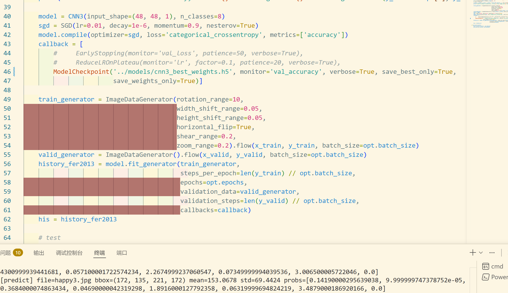 <b>原来的参数配置</b>
</td>
    <td>
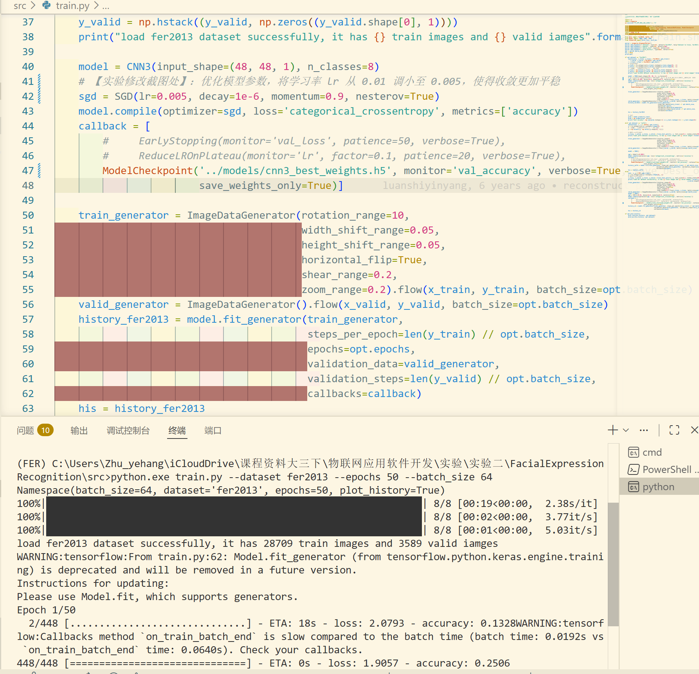 <b>新的参数配置及运行</b>
</td>
  </tr>
</table>

## 5. 实时视频推流识别扩展实验 (Bonus)

为充分验证模型端侧的实时推理效果，并达成《实验指南》中补充点要求，我们在工程的 `src/` 中成功配置并运行了摄像头采集模块 `recognition_camera.py`。
- 其依赖基于深度学习的轻量级目标检测模型 `BlazeFace` 在本地捕获动态视频流，截取人脸区域（ROI）。
- 将图像灰度化并转换为 `48×48` 的标准张量后，压入经过 200 epochs 训练且保存最佳权重的 `cnn3_best_weights.h5` 网络进行推理。
- 对预测出的一维类别进行置信度计算后，映射出具体的情绪英文首字母（如 Happy, Neutral, Sad 等），再使用 `cv2.putText` 将识别分类实时渲染画在每帧图像人脸的边框上。

> 开启指令（运行期间控制台会初始化 CUDNN 和权重环境，此时可按 ESC 随时退出并终止推流）：
> `python src/recognition_camera.py`

**实时识别成果**：
在我们实际打开系统的测试中，我们朝镜头展示了一张带有笑脸的人物照片，算法能够在镜头摇晃和光线变化的动态场景中稳稳锁定位点，并在绿框上准确地悬浮并高挑标记出 `happy`。模型表现出了优秀的实时追踪性能和可落地价值：

  <!-- 请确保存放此截图到 实验报告图片/realtime.png 或其它你实际保存的地方，这里假设是 output/realtime.png -->
   

## 6. 实验总结
通过此次实验，我们从搭建并处理常见隐藏文件跳过的踩坑开始，经历了完整的深度学习开发闭环：从调整优化 `gen_train` 适配中文和异常目录读取流；到调参使用更复杂的 `CNN3` 模型执行高达 200 个 Epoch 的彻夜训练；再到最终将静态的验证推演扩展为对接摄像头的端侧摄像头推流实时分析。尽管受限于网络浅层和原数据局限使得最终精度盘旋于可接受基准之上，但是整个表情识别系统的工程脉络和端侧落地的过程得到了非常直观深度的验证和扩展。
