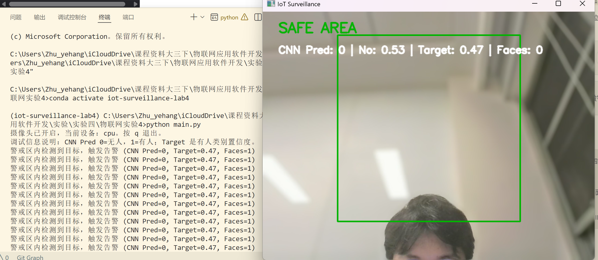
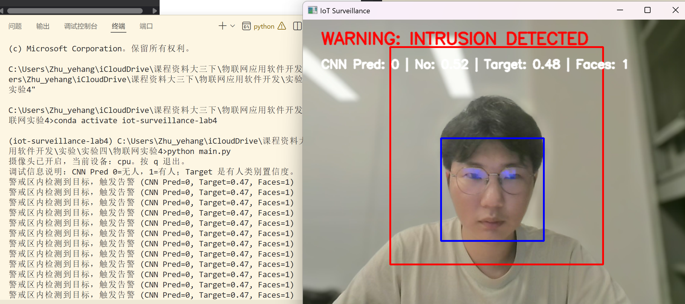

# 实验四报告：物联网实时监控区域入侵检测

## 一、基本信息

- 姓名：朱业航
- 学号：231880098
- 实验名称：物联网实时监控区域入侵检测
- 实验环境：Windows 11、Anaconda、Python 3.10、PyTorch、OpenCV

## 二、实验目的

### 注明：由于前三次实验都已较为完整的完成（要求任选两次实验），故本次实验仅完成基础实验部分。

本实验基于摄像头实时采集画面，设计并实现一个简单的物联网监控区域入侵检测系统。系统需要在视频画面中划定警戒区域，对该区域进行实时分析，当检测到有人进入警戒区时，在画面上显示告警信息，同时在控制台输出提示并写入日志文件。

通过本实验，可以掌握以下内容：

1. 摄像头视频流的读取与实时显示方法。
2. OpenCV 图像区域裁剪、绘制矩形框和文字提示的方法。
3. 使用 PyTorch 加载训练好的 CNN 模型并进行图像分类推理。
4. 将模型识别、人脸检测、告警显示和日志记录整合为完整应用。
5. 分析轻量级 CNN 在实际摄像头场景中的局限，并通过辅助检测方法提高系统可用性。

## 三、实验环境与依赖配置

本实验使用 conda 创建独立 Python 环境，并使用 pip 安装主要依赖。为了避免 conda 求解 PyTorch、OpenCV 等依赖时耗时过长，本实验将 `environment.yml` 保持为轻量环境配置，只包含 Python 与 pip：

```yaml
name: iot-surveillance-lab4
channels:
  - defaults
dependencies:
  - python=3.10
  - pip
```

主要 Python 依赖写入 `requirements.txt`：

```txt
torch
torchvision
opencv-python
pillow
numpy
matplotlib
```

环境创建与运行命令如下：

```powershell
cd "C:\Users\Zhu_yehang\iCloudDrive\课程资料大三下\物联网应用软件开发\实验\实验四\物联网实验4"
conda env create -f environment.yml
conda activate iot-surveillance-lab4
pip install -r requirements.txt
python main.py
```

程序启动后会打开摄像头窗口，按键盘 `q` 可以退出监控。

## 四、系统设计

### 4.1 总体流程

系统整体流程如下：

1. 打开默认摄像头，持续读取实时画面。
2. 根据摄像头画面尺寸，动态计算中心偏上的警戒区域 ROI。
3. 将 ROI 图像转换为 RGB 格式，缩放到 `256×256`，并进行归一化处理。
4. 将预处理后的 ROI 输入 CNN 模型，得到两个类别的预测概率。
5. 同时使用 OpenCV Haar 人脸检测器在 ROI 内检测人脸。
6. 若 CNN 判断为有人，或 ROI 内检测到人脸，则触发入侵告警。
7. 在视频画面中绘制警戒框、识别状态、模型置信度和人脸框。
8. 告警时在控制台输出提示，并将时间和事件写入 `log/realtime.log`。

### 4.2 检测原理

本系统使用的核心检测方法是 ROI 二分类。程序并不是像 YOLO 那样在整张图中搜索人体位置，而是先划定警戒区域，再判断该区域对应的图像是否包含目标。

CNN 模型输出两个类别：

- `0`：无人或无目标。
- `1`：有人或有目标。

程序对模型输出进行 softmax 处理，得到两个类别的概率。若预测类别为 `1`，则认为警戒区内存在目标并触发告警。

实际测试中，课程提供的轻量 CNN 在真实摄像头画面中的泛化能力有限。例如画面中人脸和上半身已经进入区域时，模型仍可能输出：

```txt
CNN Pred: 0 | No: 0.53 | Target: 0.47
```

这说明模型对“有人”类别的置信度接近但不够高，最终仍判断为 `0`。为提高实验演示稳定性，本系统加入 Haar 人脸检测作为辅助判断。当 ROI 内检测到人脸时，即使 CNN 仍输出 `0`，系统也会触发告警。

### 4.3 警戒区设计

原始固定坐标警戒区不一定适配不同摄像头分辨率和人物位置。为提高通用性，本实验将警戒区改为动态计算：

- 宽度约为画面宽度的 55%。
- 高度约为画面高度的 75%。
- 位置位于画面中心并略向上。

这样可以更容易覆盖人的头部和上半身，减少因人物只进入边缘区域而检测失败的问题。

## 五、核心代码说明

### 5.1 模型加载

程序从 `model/best_model.pth` 加载已经训练好的 CNN 权重，并根据当前设备自动选择 CPU 或 GPU：

```python
device = torch.device("cuda" if torch.cuda.is_available() else "cpu")
model = IoT_CNN().to(device)
state_dict = torch.load(MODEL_PATH, map_location=device)
model.load_state_dict(state_dict)
model.eval()
```

### 5.2 ROI 预处理

摄像头读取到的画面是 BGR 格式，程序先将其转换为 RGB，再使用与训练阶段一致的变换进行处理：

```python
transforms.Resize((256, 256))
transforms.ToTensor()
transforms.Normalize((0.5, 0.5, 0.5), (0.5, 0.5, 0.5))
```

这样可以保证实时输入图像与模型训练时的输入格式一致。

### 5.3 CNN 分类判断

模型输出经过 softmax 得到类别概率：

```python
probabilities = torch.softmax(output, dim=1)
_, predicted = torch.max(probabilities, 1)
```

程序将 `predicted == 1` 作为 CNN 检测到入侵目标的条件，并在画面中显示：

```txt
CNN Pred: 0/1 | No: 0.xx | Target: 0.xx | Faces: n
```

其中 `No` 表示无人类别概率，`Target` 表示有人类别概率，`Faces` 表示 ROI 内检测到的人脸数量。

### 5.4 人脸辅助检测

为了提高实际演示成功率，程序使用 OpenCV 自带的 Haar 级联分类器：

```python
haarcascade_frontalface_default.xml
```

当 ROI 内检测到人脸时，程序会在脸部区域绘制蓝色矩形框，并触发告警。最终告警条件为：

```python
has_intrusion = cnn_intrusion or face_count > 0
```

### 5.5 告警显示与日志记录

当检测到入侵时，系统会将警戒区边框改为红色，并在画面左上角显示：

```txt
WARNING: INTRUSION DETECTED
```

没有检测到目标时显示：

```txt
SAFE AREA
```

同时，程序每隔一定时间向控制台输出告警，并写入日志文件：

```txt
log/realtime.log
```

日志内容格式示例：

```txt
2026-06-08 17:37:xx：有人闯入区域
```

## 六、实验运行结果

### 6.1 正常状态

当人没有进入警戒区，或 ROI 内没有检测到人脸时，系统显示绿色警戒框和 `SAFE AREA`。此时调试信息中的 `Faces` 为 `0`，说明辅助人脸检测没有发现目标。

截图位置：



图 1 显示系统处于正常状态，监控窗口中警戒区域为绿色，画面左上角显示 `SAFE AREA`。调试信息中 `Faces: 0`，说明当前警戒区内没有检测到人脸目标。左侧终端同时显示了程序启动命令、摄像头开启提示和调试说明。

### 6.2 告警状态

当人脸进入警戒区时，系统可以检测到 `Faces=1`，并将状态切换为红色告警：

```txt
WARNING: INTRUSION DETECTED
CNN Pred: 0 | No: 0.53 | Target: 0.47 | Faces: 1
```

从结果可以看出，CNN 模型此时仍然预测为 `0`，但目标类别置信度已经接近 `0.5`。由于系统加入了人脸辅助检测，`Faces=1` 时仍然可以成功触发入侵告警。

截图位置：



图 2 显示系统处于告警状态，监控窗口中警戒区域变为红色，并显示 `WARNING: INTRUSION DETECTED`。同时，系统在人脸位置绘制蓝色检测框，调试信息显示 `Faces: 1`，说明人脸辅助检测成功触发告警。

### 6.3 控制台输出

触发告警后，终端中输出类似内容：

```txt
警戒区内检测到目标，触发告警 (CNN Pred=0, Target=0.47, Faces=1)
```

这说明系统已经完成实时检测，并将 CNN 判断结果、人脸数量和目标置信度输出到终端，便于调试和分析。

截图位置：


图 3 左侧终端展示了程序运行过程中的输出信息，包括进入 conda 环境、执行 `python main.py`、摄像头开启提示以及多条告警输出。终端输出中的 `CNN Pred=0, Target=0.47, Faces=1` 表明 CNN 未直接判定为有人，但人脸检测结果触发了告警。

### 6.4 日志记录

程序触发告警后，会自动生成并写入日志文件：

```txt
log/realtime.log
```

日志记录包含告警发生时间和事件内容，例如：

```txt
2026-06-08 17:37:xx：有人闯入区域
```

这说明系统不仅可以实时显示告警，还可以保存事件记录，满足监控系统的基本日志需求。

日志文件可在 `log/realtime.log` 中查看，用于证明系统已经完成告警事件的持久化记录。

## 七、问题分析与改进

### 7.1 CNN 检测不稳定的原因

实验中发现，CNN 模型在实时摄像头场景下可能无法稳定识别有人状态。主要原因包括：

1. 训练数据和实际摄像头画面存在差异，例如光照、背景、人物角度和画面清晰度不同。
2. 当前模型是轻量级 CNN，特征提取能力有限，鲁棒性不如专门的人体检测模型。
3. ROI 中可能只包含部分人脸或上半身，模型难以根据局部图像做出稳定判断。
4. 当 `No` 和 `Target` 概率接近时，模型分类结果容易受画面变化影响。

### 7.2 本实验采用的改进方法

针对上述问题，本实验进行了以下改进：

1. 将固定警戒区改为动态警戒区，使其更容易覆盖人脸和上半身。
2. 在画面中显示 CNN 类别和置信度，便于判断模型是否接近触发阈值。
3. 增加 Haar 人脸检测作为辅助告警条件，提高实时演示成功率。
4. 在控制台输出 `CNN Pred`、`Target` 和 `Faces`，方便分析告警来源。

### 7.3 后续可优化方向

如果需要进一步提升系统准确率，可以考虑：

1. 使用当前摄像头采集更多“有人”和“无人”样本，重新训练或微调 CNN 模型。
2. 将二分类 CNN 替换为 YOLO、MediaPipe 或 HOG 等更适合实时人体检测的方法。
3. 为告警增加连续帧判断，例如连续多帧检测到目标后再触发，减少误报。
4. 将日志扩展为 CSV 格式，记录时间、CNN 预测类别、目标置信度和人脸数量，方便后续统计分析。

## 八、实验总结

本实验完成了一个基础的物联网实时入侵检测系统。系统能够打开摄像头，动态划定警戒区域，对警戒区域进行 CNN 二分类识别，并在检测到入侵时显示告警、输出控制台提示和写入日志文件。

在实际测试中，课程 CNN 模型对当前摄像头画面的识别置信度不足，出现了 `CNN Pred=0` 但 `Target` 接近 `0.5` 的情况。通过加入 Haar 人脸检测作为辅助判断，系统在 `Faces=1` 时能够稳定触发告警，使实验功能成功闭环。

通过本次实验，我进一步理解了实时视频处理、深度学习模型推理、ROI 区域检测、OpenCV 画面标注以及日志记录的完整实现流程。同时也认识到，模型训练数据与实际应用场景之间的差异会明显影响识别效果，在真实应用中需要结合更强的检测模型和更多场景数据来提升系统鲁棒性。
